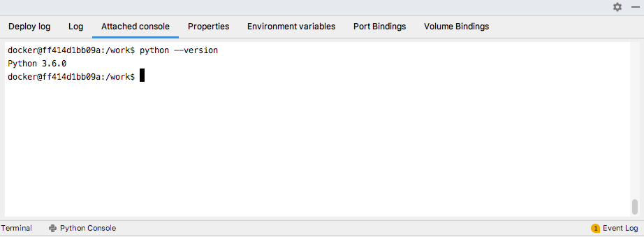

# cookiecutter-pycharm-remote-docker

[Cookiecutter](https://github.com/audreyr/cookiecutter)を用いた、PyCharmでリモートDocker環境で開発するためのプロジェクトテンプレート

- 毎回行うPyCharmの設定を簡略化し、リモートDocker環境での開発をすぐ開始できる
- DockerfileやPythonスクリプト、unittest、sphinxのドキュメント用の実行・デバッグの構成は作成済み
- nvidia-dockerの利用もサポートしており、Deep LearningやComputer Visionのプロジェクトでは役立つ


## Requirements

- Cookiecutter >= 1.4 [(install cookiecutter)](https://cookiecutter.readthedocs.io/en/latest/installation.html#install-cookiecutter)
- PyCharm Professional >= 2018.2
    - **Dockerでのリモート開発はPyCharm Professionalのみ対応**

## Getting Started

### Configure the Docker daemon connection settings

PyCharmからリモートのdocker apiに接続するために、初回のみremote側で設定を行う必要がある。

詳細は以下の記事を読んでください。

- [Docker - How do I enable the remote API for dockerd](https://success.docker.com/article/how-do-i-enable-the-remote-api-for-dockerd)

#### (Optional) Configuring for using nvidia-docker

nvidia-dockerを利用する場合、docker runtimeのデフォルト値を以下のように変更してください。

```bash
$ sudo vi /etc/docker/daemon.json
$ cat /etc/docker/daemon.json
{
    "default-runtime": "nvidia",
    "runtimes": {
        "nvidia": {
            "path": "nvidia-container-runtime",
            "runtimeArgs": []
        }
    }
}
$ sudo systemctl daemon-reload
$ sudo service docker restart
$ docker info | grep -i runtime
Runtimes: nvidia runc
Default Runtime: nvidia #=> OK !
``` 

次に、PyCharmでremote docker apiを登録する。

- 以下のように、Dockerの設定を追加（例えば Docker-remote）
    - **この名前はあとで使います**


See Also
- [Docker - Help | PyCharm](https://www.jetbrains.com/help/pycharm/docker-connection-settings.html)

### Generate Project

`cookiecutter git@github.com:tkat0/cookiecutter-pycharm-remote-docker.git` を実行。

いくつか対話に答えることで、プロジェクトのディレクトリが生成されます。

```bash
# Create a project from cookiecutter-pycharm-remote-docker template
$ cookiecutter git@github.com:tkat0/cookiecutter-pycharm-remote-docker.git
full_name [Your Name]: tkat0
email [Your email]: tkato.dev@gmail.com"
project_name [project_name]: sample-project
project_slug [sample_project]:
project_short_description []: sample project
version [0.1.0]:
timezone [Asia/Tokyo]:
python_version [3.6.0]:
remote_host [remote machine ip-addr or host-name]: 192.168.0.2
remote_docker_name [Docker-remote]:
remote_uid [remote user id (result of "ssh 192.168.0.2 id -u")]:1003
remote_work_dir [remote working directory. (e.g. /home/your-name/PycharmProjects/)]:/home/tkato/PycharmProjects/
Select use_nvidia_docker:
1 - no
2 - yes
Choose from 1, 2 [1]: 2
```
- `python_version`: pyenvでインストールされる、Pythonのバージョン
- `timezone`: コンテナ内のタイムゾーンを指定
- `remote_docker_name`: 前項で設定したDocker apiの名前を指定する（例 Docker-remote）。
- `remote_uid`: ホストとコンテナでファイルのパーミッションの問題を避けるために、ホストと同じuidをコンテナでも設定する 

YAMLのconfigファイルを書くことで、リポジトリ生成時のデフォルト値を変更できて便利。

```bash
# to overwrite configuration, you create config.yml
# see. https://cookiecutter.readthedocs.io/en/latest/advanced/user_config.html
$ vi ~/config.yml
$ cat ~/config.yml
default_context:
    full_name: "tkat0"
    email: "tkato.dev@gmail.com"
    timezone: "Asia/Tokyo"
    python_version: "3.4.0"
    remote_host: "192.168.0.2"
    remote_uid: "1003"
    remote_work_dir: "/home/tkato/PycharmProjects/"
$ cookiecutter --config-file ~/config.yml git@github.com:tkat0/cookiecutter-pycharm-remote-docker.git
full_name [tkat0]:
email [tkato.dev@gmail.com]:
project_name [project_name]:
project_slug [project_name]:
project_short_description []:
version [0.1.0]:
timezone [Asia/Tokyo]:
python_version [3.4.0]:
remote_host [192.168.0.2]:
remote_docker_name [Docker-remote]:
remote_uid [1003]:
remote_work_dir [/home/tkato/PycharmProjects/]:
```

最後に、生成されたディレクトリをPyCharmで開く。


### PyCharm Settings

#### Configuring Synchronization with remote server

- `Preferences > Build, Execution, Deployment > Deployment` を開き、`remote` サーバーを選択
- `User name` と `Password` を入力し、`Test Connection` ボタンをクリックして接続確認


- リモートサーバーにリポジトリをアップロードするため、プロジェクトのrootを選択した状態で右クリックし、`Deployment > Upload to remote` をクリック


デフォルトで、変更したファイルを自動でアップロードするようになっている。
自動でアップロードしたくない場合は、`Build, Execution, Deployment > Deployment > Options` を開いて `Upload changed files automatically to the default server` を `Never` に設定

#### Build docker image on remote server

Docker Imageのビルド設定はすでに作成済。

- ビルド前に、もし必要なら `docker/Dockerfile` と `requirements*.txt` を変更してください
- `docker build` を実行すると、リモーt−サーバーでDockerのビルドが実行される


- ビルド成功


#### Configuring Docker as remote interpreter

- `Preferences > Project: {your-project-name} > Project Interpreter` の :gear: → `Add` をクリック


- `Add Python Interpreter` を開き、以下のように設定


- リモートサーバーのパッケージが読み込まれたことを確認


See Also
- [Configuring Remote Interpreter via Docker - Help | PyCharm](https://www.jetbrains.com/help/pycharm/using-docker-as-a-remote-interpreter.html#config-docker)

### Run, debug and test on remote server

サンプルの実行・デバッグの設定もすでに作成済で、すぐ実行できる。

- Run `main.py`


- Run `test all`


- Set breakpoint
- Debug `test all`


これらの設定をコピペして、好きなように役立ててください :tada:


### Build Document

Sphinxのドキュメントのテンプレートとビルド設定も設定済なので、PyCharmでSphinxのビルドもできます。


ドキュメントもリモートサーバーでビルドされるので、見る場合はWebサーバーを立てるなり。

```bash
$ ssh {remote-host}
$ cd {path-to-remote-work-dir}/docs/build/html
$ python3 -m http.server 8000
```


もちろん、Deploymentでローカルにダウンロードしてもよいし、ローカル用のDockerImageをビルドし、設定を修正してローカルでSphinxをビルドしても良い。

### Login Docker Container

DockerコンテナにPyCharm上でログインすることもできる。




## Acknowledgement

以下のリポジトリを参考にしました。感謝。

- [audreyr/cookiecutter-pypackage](https://github.com/audreyr/cookiecutter-pypackage): Cookiecutter template for a Python package.
- [docker-science/cookiecutter-docker-science](https://github.com/docker-science/cookiecutter-docker-science): Cookiecutter template for data scientists working with Docker containers


## License

Apache 2.0 License (see [LICENSE](./LICENSE) file).

