# cookiecutter-pycharm-remote-docker

PyCharm project template for development in remote docker environment using [Cookiecutter](https://github.com/audreyr/cookiecutter)

- You can simplify PyCharm configurations every time and start development with remote docker quickly.
- The Run/Debug configuration of Dockerfile, sample python script, unittest and sphinx document is already created.
- nvidia-docker is supported. It will be useful in a project like DeepLearning and Computer Vision.

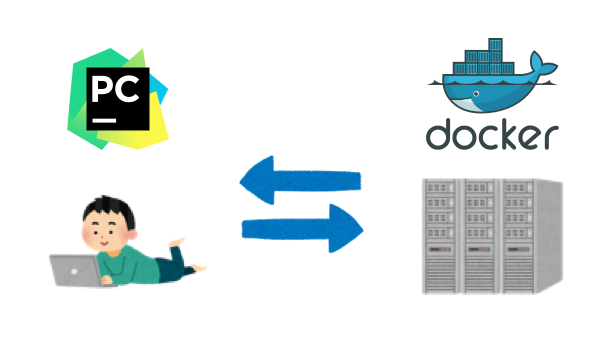


## Requirements

- Cookiecutter >= 1.4 [(install cookiecutter)](https://cookiecutter.readthedocs.io/en/latest/installation.html#install-cookiecutter)
- PyCharm Professional >= 2018.2
    - **Docker-based interpreters is supported only in PyCharm Professional**

## Getting Started

### Configure the Docker daemon connection settings

In order to connect to remote docker api from PyCharm, you first need to enable remote api of dockerd.
This setting is set only once on the remote machine.

Please see the following article and set it up.

- [Docker - How do I enable the remote API for dockerd](https://success.docker.com/article/how-do-i-enable-the-remote-api-for-dockerd)

#### (Optional) Configuring for using nvidia-docker

If you want to use nvidia-docker, change the default value of docker runtime by making the following settings.

```bash
$ sudo vi /etc/docker/daemon.json
$ cat /etc/docker/daemon.json
{
    "default-runtime": "nvidia",
    "runtimes": {
        "nvidia": {
            "path": "nvidia-container-runtime",
            "runtimeArgs": []
        }
    }
}
$ sudo systemctl daemon-reload
$ sudo service docker restart
$ docker info | grep -i runtime
Runtimes: nvidia runc
Default Runtime: nvidia #=> OK !
``` 

Next, register the remote docker api in PyCharm.

- Add new Docker configuration (e.g. Docker-remote) and set as follows.
    - **This name is used later.**

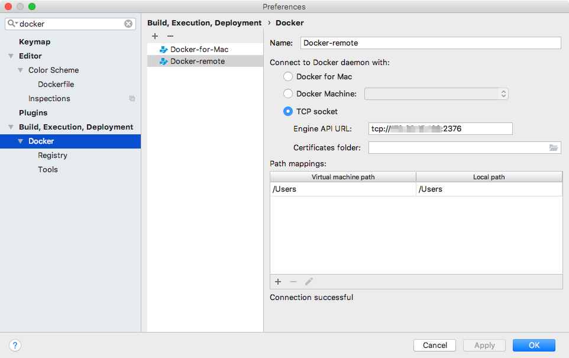

See Also
- [Docker - Help | PyCharm](https://www.jetbrains.com/help/pycharm/docker-connection-settings.html)

### Generate Project

Please run `cookiecutter git@github.com:tkat0/cookiecutter-pycharm-remote-docker.git`

By answering some questions, project directory are automatically generated.

```bash
# Create a project from cookiecutter-pycharm-remote-docker template
$ cookiecutter git@github.com:tkat0/cookiecutter-pycharm-remote-docker.git
full_name [Your Name]: tkat0
email [Your email]: tkato.dev@gmail.com"
project_name [project_name]: sample-project
project_slug [sample_project]:
project_short_description []: sample project
version [0.1.0]:
timezone [Asia/Tokyo]:
python_version [3.6.0]:
remote_host [remote machine ip-addr or host-name]: 192.168.0.2
remote_docker_name [Docker-remote]:
remote_uid [remote user id (result of "ssh 192.168.0.2 id -u")]:1003
remote_work_dir [remote working directory. (e.g. /home/your-name/PycharmProjects/)]:/home/tkato/PycharmProjects/
Select use_nvidia_docker:
1 - no
2 - yes
Choose from 1, 2 [1]: 2
```
- `python_version`: python version installed with pyenv.
- `timezone`: This is set to match the timezone of host and container in the remote server.
- `remote_docker_name`: You should set the same name set in PyCharm in the previous section (e.g. Docker-remote).
- `remote_uid`: This is set to match the file permissions of host and container in the remote server.

To change the default value, you can create a config yaml file.

```bash
# to overwrite configuration, you create config.yml
# see. https://cookiecutter.readthedocs.io/en/latest/advanced/user_config.html
$ vi ~/config.yml
$ cat ~/config.yml
default_context:
    full_name: "tkat0"
    email: "tkato.dev@gmail.com"
    timezone: "Asia/Tokyo"
    python_version: "3.4.0"
    remote_host: "192.168.0.2"
    remote_uid: "1003"
    remote_work_dir: "/home/tkato/PycharmProjects/"
$ cookiecutter --config-file ~/config.yml git@github.com:tkat0/cookiecutter-pycharm-remote-docker.git
full_name [tkat0]:
email [tkato.dev@gmail.com]:
project_name [project_name]:
project_slug [project_name]:
project_short_description []:
version [0.1.0]:
timezone [Asia/Tokyo]:
python_version [3.4.0]:
remote_host [192.168.0.2]:
remote_docker_name [Docker-remote]:
remote_uid [1003]:
remote_work_dir [/home/tkato/PycharmProjects/]:
```

Finaly, open this project directory with PyCharm.


### PyCharm Settings

#### Configuring Synchronization with remote server

- Open `Preferences > Build, Execution, Deployment > Deployment` and find `remote` server.
- Enter `User name` and `Password`, click `Test Connection` button and confirm that you can connect.

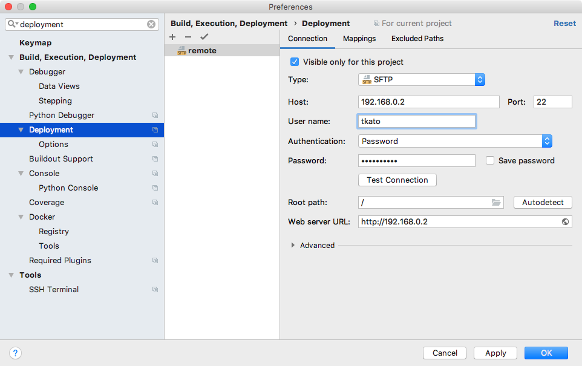

- To Upload repository to remote server, select project root directory, right click and click `Deployment > Upload to remote`

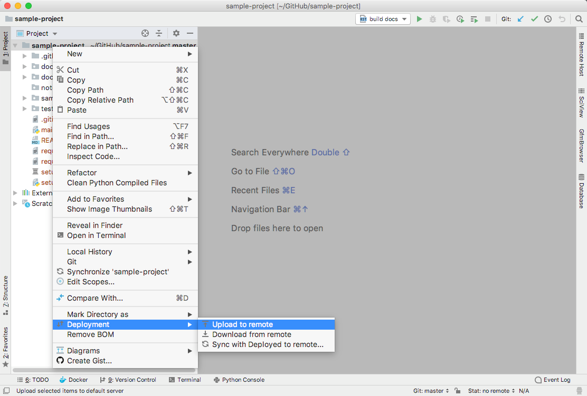

By default, changed files automatically upload.
If you don't like it, open `Build, Execution, Deployment > Deployment > Options` and set `Upload changed files automatically to the default server` to `Never`

#### Build docker image on remote server

The build configuration has already been created.

- Update `docker/Dockerfile` and `requirements*.txt` if necessary.
- Run `docker build` and docker build on remote server

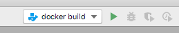

- Build success

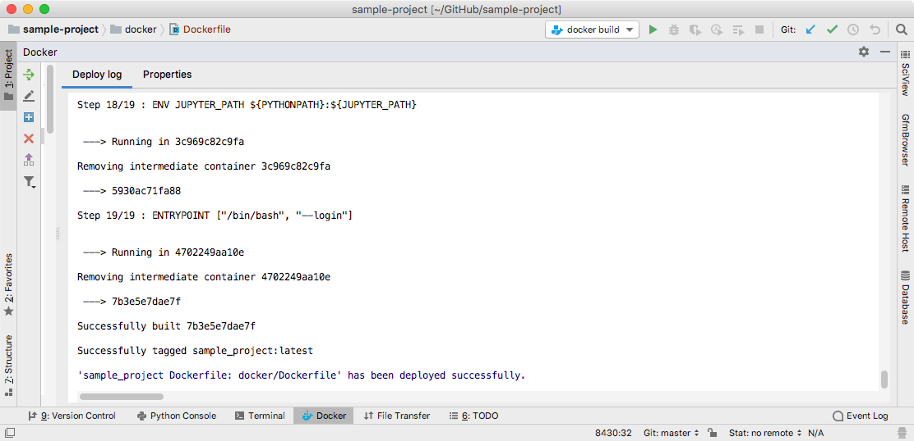


#### Configuring Docker as remote interpreter

- Open `Preferences > Project: {your-project-name} > Project Interpreter`, click :gear: button and  click `Add`.

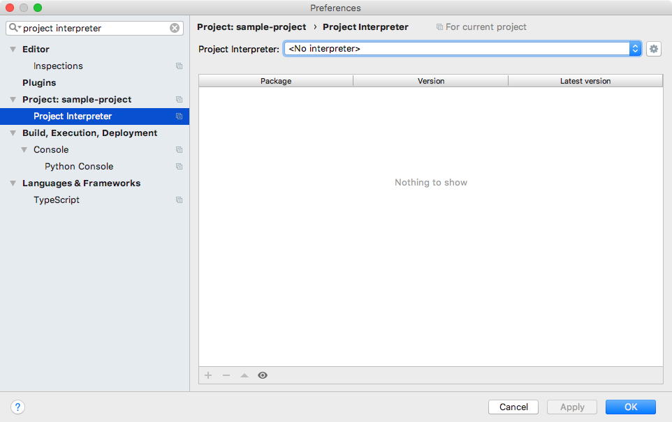

- Open `Add Python Interpreter` and enter as follows.


- Confirm that the remote package can be load.

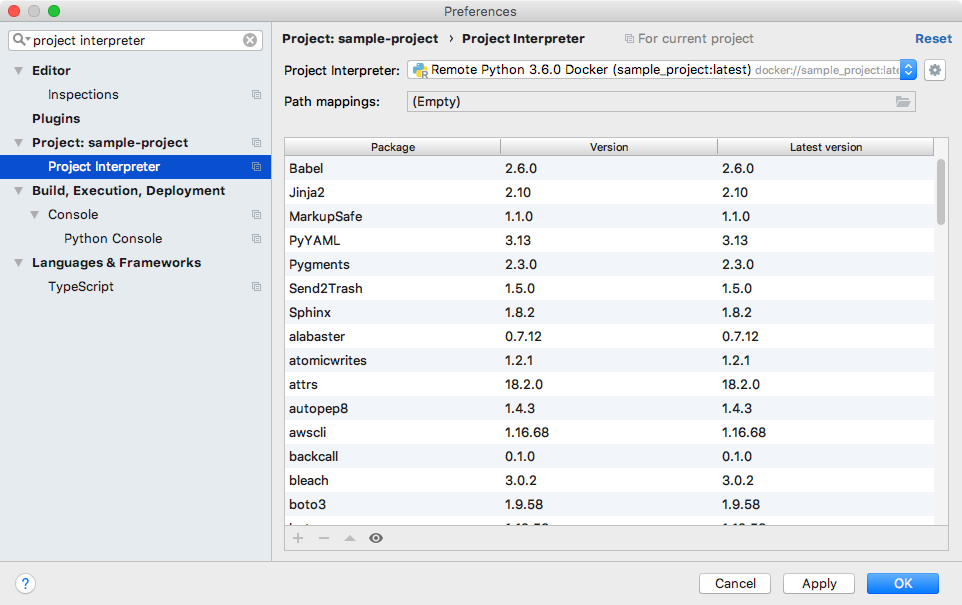

See Also
- [Configuring Remote Interpreter via Docker - Help | PyCharm](https://www.jetbrains.com/help/pycharm/using-docker-as-a-remote-interpreter.html#config-docker)

### Run, debug and test on remote server

The sample Run/Debug Configurations are already created so you can Run/Debug immediately.

- Run `main.py`

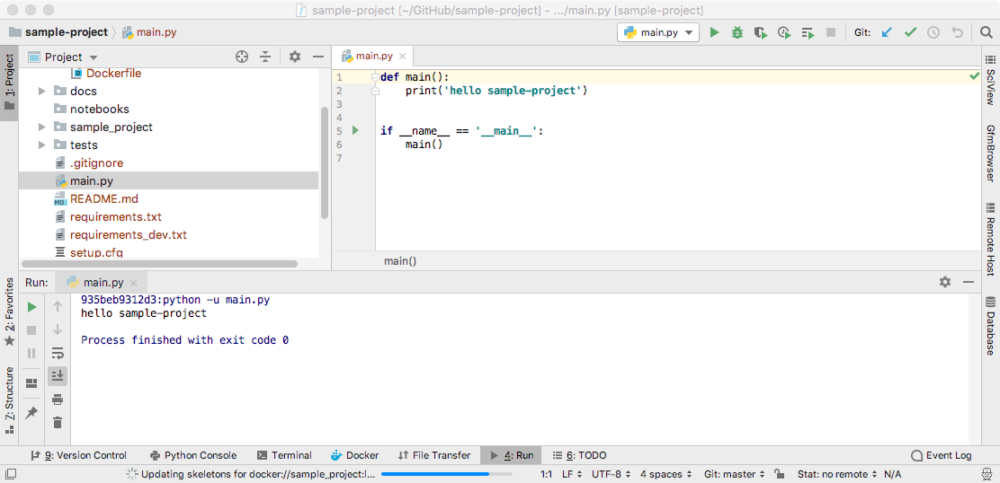

- Run `test all`

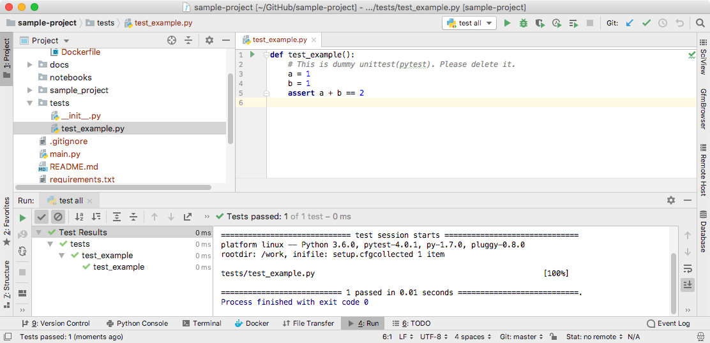

- Set breakpoint
- Debug `test all`

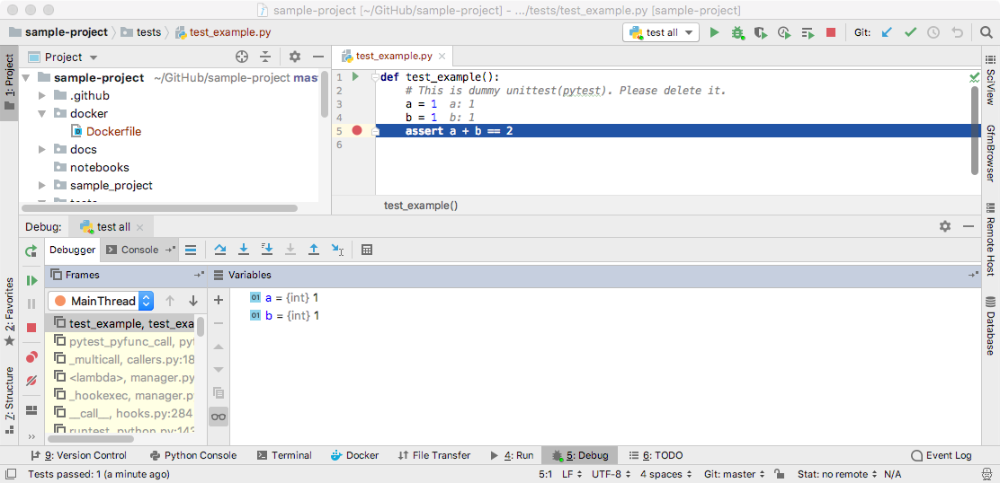

Please copy these settings and use it for you :tada:


### Build Document

Sphinx document templates and build configuration are also included.
You can build Sphinx from PyCharm.


To view the document, build a web server on the remote server.

```bash
$ ssh {remote-host}
$ cd {path-to-remote-work-dir}/docs/build/html
$ python3 -m http.server 8000
```

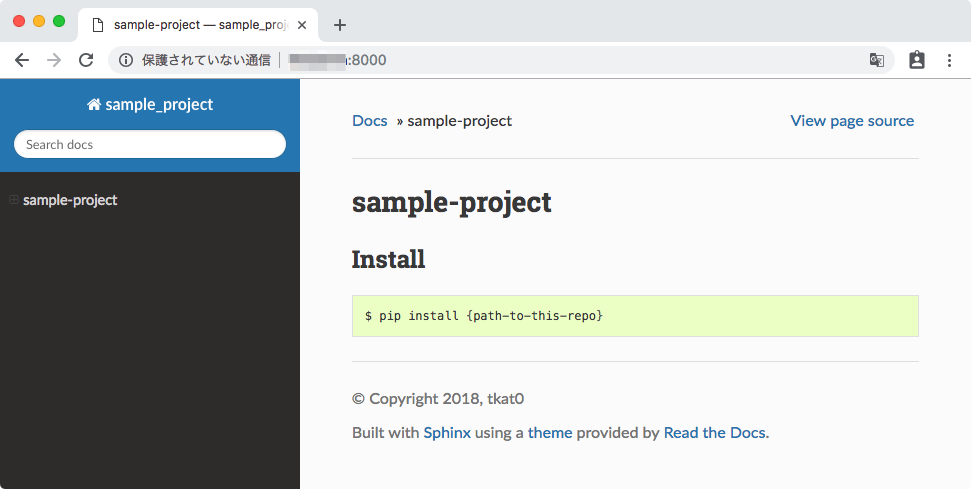

Of course, you can download it by locally using Deployment function.


## Acknowledgement

I learnt a lot from the following projects when create this repository.

- [audreyr/cookiecutter-pypackage](https://github.com/audreyr/cookiecutter-pypackage): Cookiecutter template for a Python package.
- [docker-science/cookiecutter-docker-science](https://github.com/docker-science/cookiecutter-docker-science): Cookiecutter template for data scientists working with Docker containers


## License

Apache 2.0 License (see [LICENSE](./LICENSE) file).

